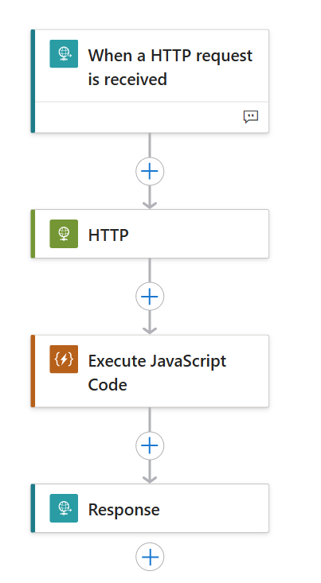
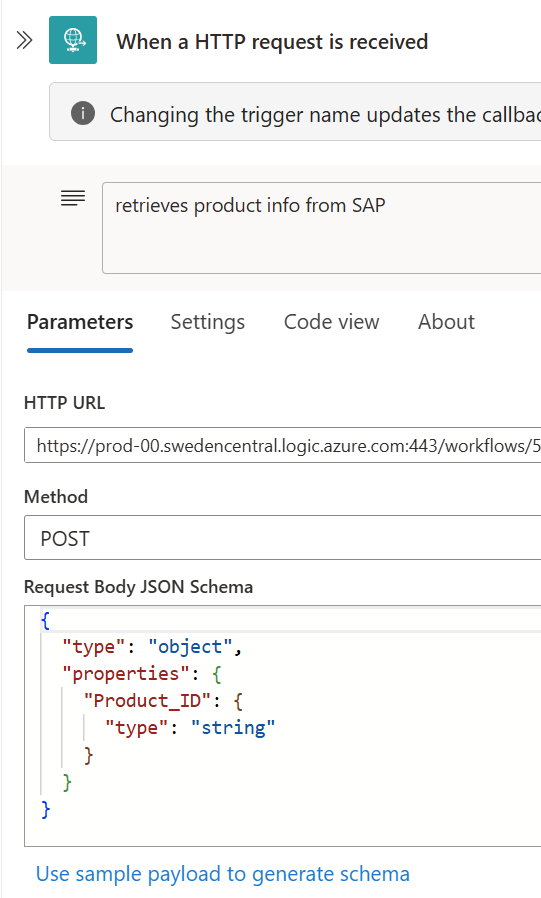
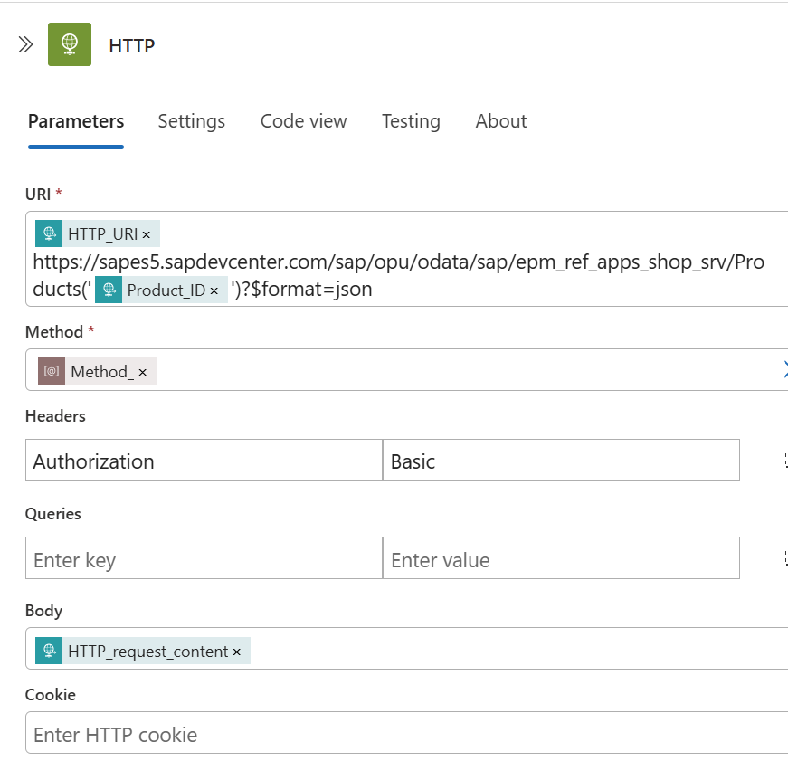
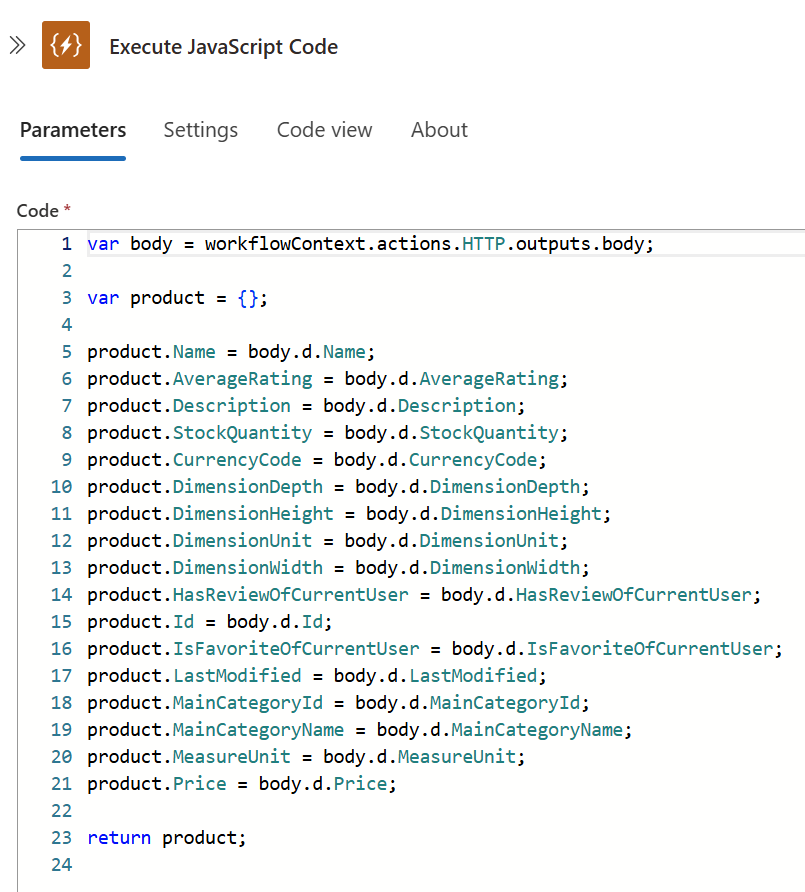
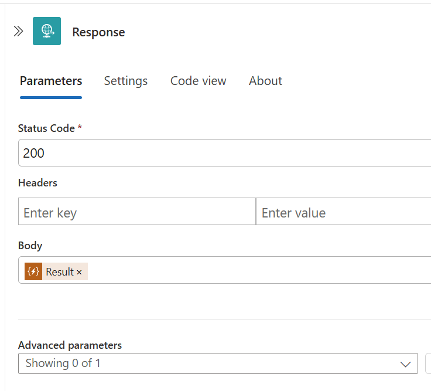

Semantic Kernel example for using AzureAIAgent in a chat loop context with a kernel plugin calling an Azure Logic App 

How to use:

Clone the repository.

Install Python requirements from the requirements.txt file.

Create an Azure Foundry project with a model of choice, e.g. gpt-4o.

Insert Azure Foundry project URL and other details in an .env file - use example.env as your example

Create an Azure Logic App for consuming an OData service - see description below.

Insert the URL to the Azure Logic App workflow into the .env file.

How to create the Logic App:

Create a Logic App with the above steps. Enhance the steps as follows:

Step 1:

Nothing special; this is just the entry point. The URL will be generated automatically.

Remember to set the Request Body JSON Schema as seen in the image - we pass the Product_ID parameter as part of the request body. Also, the request type must be POST, not GET.

(Ah, OK, so there was something special after all...)

Step 2:

Here, we add the URL to the SAP ES5 demo system Products OData service:

https://sapes5.sapdevcenter.com/sap/opu/odata/sap/epm_ref_apps_shop_srv/Products

We then insert the "Product_ID" parameter from the first step - this can be done using the Dynamic Content functionality in the Logic Apps designer.

We also set the authentication type to Basic, as shown. Next, we scroll further down and add our SAP user/password (you will need to register for access to ES5 (ask chatGPT how to) or use your own SAP system.)

Step 3:

Here, we extract whatever info we need from the OData response. The code shown will work fine for the Products service.

Step 4:

This is the end, as Jim Morrison stated. Here, there truly is nothing special. We return the result of the previous step.

